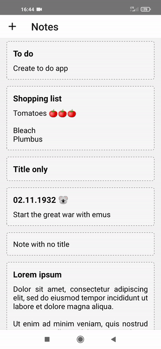
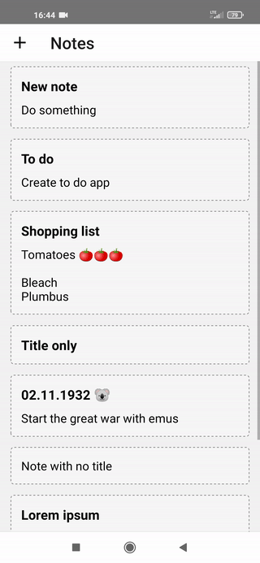
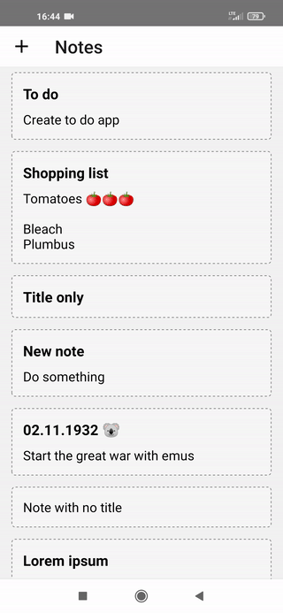
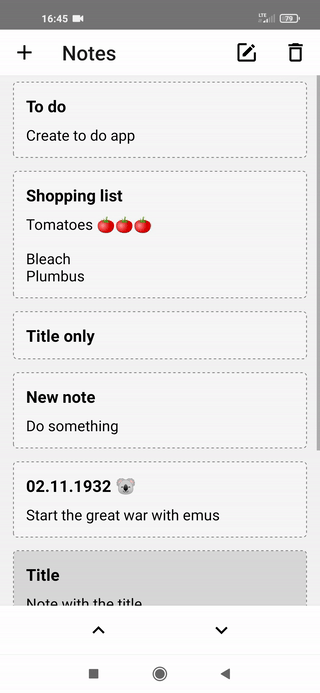

<p align="center">
    
    <h1 align="center">Notki</h1>
</p>

## :clipboard: About
Notki is a simple, minimalistic to-do app made for Android in React Native CLI. You can add new notes, edit, delete or reorder them.

## :iphone: Preview
<br />
<p>
    
    
    
    
</p>
<br />

## :hammer: Try it yourself
You can run the app on Android simulator or on real device. For that you're gonna need installed and setted-up Android Studio. [Here](https://reactnative.dev/docs/environment-setup) you can find guide how to do it.

Open terminal, go to destination directory and run the following commands:

```bash
#Clone this repository
git clone https://github.com/kamilkazor/Notki.git
cd Notki

# Install dependencies
npm install

# Run the app
npm run android
```
